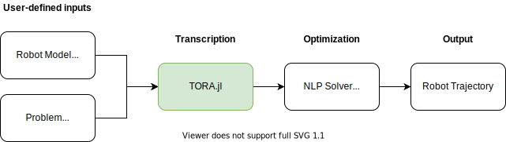

# TORA.jl

*TORA* stands for **T**rajectory **O**ptimization for **R**obot **A**rms.

To get started, see the [Tutorial](@ref).

## Summary

This package allows users to define tasks for robot manipulators with simple *high-level descriptions*. Then, TORA.jl does the heavy-lifting!
It converts those descriptions into numerical optimization problems, which are in turn tackled by state-of-the-art solvers.
The final result of the optimization is a full trajectory (joint *positions*, joint *velocities*, and joint *torques*) taking into account the whole-body dynamics of the system.
These trajectories can be commanded to your favourite robot, either in simulation or in real life.

```@raw html
<figure>
    
    <figcaption><strong>Diagram 1.</strong> Intended use of this package.</figcaption>
</figure>
```

## Functionality

Currently, the highlights of TORA.jl are as follows:

- Simple interface to define constrained motion-planning problems
- Formulation of the optimal control problem using *Direct Transcription*
- Optimization of NLP problems using state-of-the-art solvers ([Ipopt.jl](https://github.com/jump-dev/Ipopt.jl) and [KNITRO.jl](https://github.com/jump-dev/KNITRO.jl))
- Full system dynamics enforced with either *forward* or *inverse* dynamics ([RigidBodyDynamics.jl](https://github.com/JuliaRobotics/RigidBodyDynamics.jl))
- Automatic differentiation of sparse Jacobians ([ForwardDiff.jl](https://github.com/JuliaDiff/ForwardDiff.jl) and [SparseDiffTools.jl](https://github.com/JuliaDiff/SparseDiffTools.jl))
- Automatic sparsity detection of Jacobians ([SparsityDetection.jl](https://github.com/SciML/SparsityDetection.jl))
- Visualization of robot models and motion plans ([MeshCat.jl](https://github.com/rdeits/MeshCat.jl))

## About

Overall, the *direct transcription* technique implemented in TORA.jl stems from:
- Betts, John T. [*Practical Methods for Optimal Control and Estimation Using Nonlinear Programming*](https://epubs.siam.org/doi/book/10.1137/1.9780898718577). SIAM, 2010.
